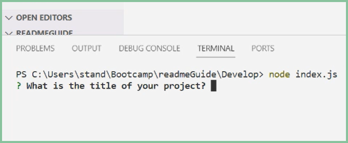
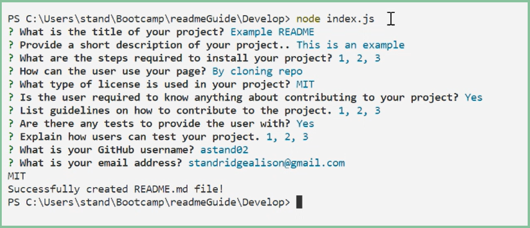
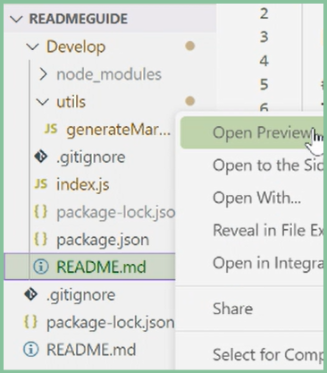

# README Guide

  

  ## Description 
   This application will walk you through a series of questions in order to create your personally genertated readme file

  ## Table Of Contents
  - [Installation](#installation)
  - [Usage](#usage)
  - [License](#license)
  - [Contributing](#contributing)
  - [Tests](#tests)
  - [Questions](#questions)

  ## Installation
  To install this application you must have node.js installed through the terminal using 'npm install'.

  ## Usage 
  To use this application you must run node index.js as displayed below,
  

  Once you have clicked ENTER, the terminal will then walk you through a series of basic questions found in almost every professional README.md file,
  

  When you are done answering all the questions the README.md file should be automatically saved in your folder,
  

  The file can then be altered to your liking.

  ## Questions 
  Feel free to contact me directly at standridgealison@gmail.com for more information about this project. 
  To check out my other github repositories click the link
  https://github.com/astand02.

